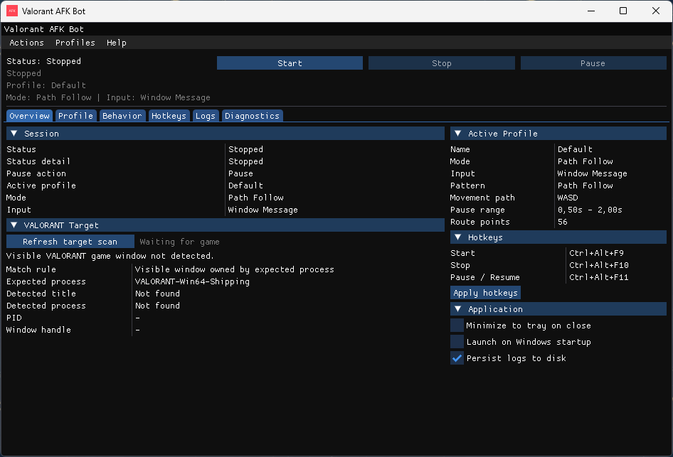
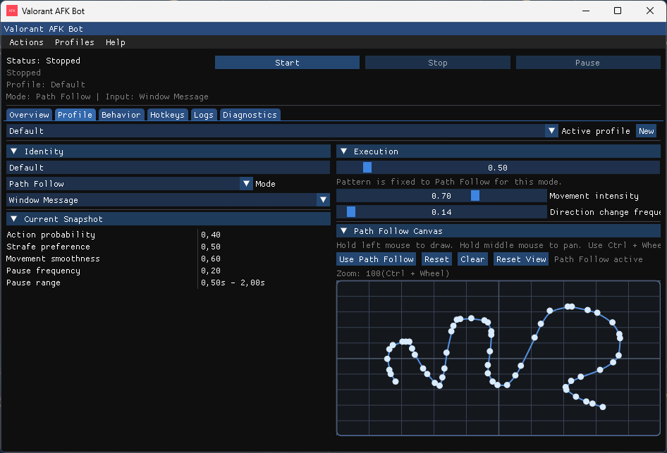
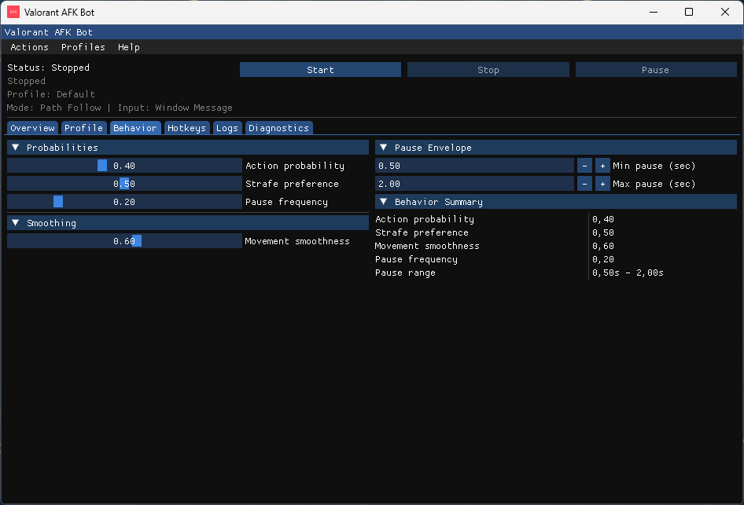

# Valorant AFK Bot

Valorant AFK Bot is a Windows desktop app that helps keep your VALORANT session active with lightweight movement profiles, hotkeys, and tray controls.

The app stays in user mode only. It does not ship a driver, kernel component, or anti-cheat bypass. You use it at your own risk.

## Download

1. Open [Releases](https://github.com/fresh-milkshake/valorant-afk-bot/releases/latest).
2. Download the latest Windows archive.
3. Extract it to any folder.
4. Run `anti-afk.exe`.

## How to use

1. Launch VALORANT and get to the place where you want the anti-AFK routine to run.
2. Open the app and check the `Overview` tab to make sure the visible VALORANT window is detected.
3. Pick an existing profile or create a new one.
4. Choose the mode that fits your use case:
   - `Jumping`: periodic jumps with light variation.
   - `WASD`: randomized movement with pauses and tuning.
   - `Path Follow`: repeats the route you draw on the canvas.
5. Press `Start`.
6. Use `Pause`, `Stop`, or the global hotkeys at any time.
7. Minimize the app to the tray if you do not want the window open all the time.

Default hotkeys:

- `Ctrl+Alt+F9` to start
- `Ctrl+Alt+F10` to stop
- `Ctrl+Alt+F11` to pause or resume

## Main screen

The `Overview` tab is the fastest way to confirm that everything is ready before you start. It shows current status, active profile, input mode, target detection state, hotkeys, and application-level toggles like tray behavior, startup launch, and log persistence.

## Profiles and movement modes

Profiles let you save separate setups for different situations. You can rename them, duplicate them, switch input strategy, and keep a dedicated movement style per profile.

`Path Follow` mode includes a canvas where you can draw the exact route you want to loop. This is useful when you want more control than simple randomized WASD movement.

## Behavior tuning

The `Behavior` tab exposes the movement controls that matter in daily use:

- `Action probability` adjusts how often extra actions are mixed in
- `Strafe preference` changes how often the movement favors side-to-side motion
- `Pause frequency` and pause range control how often the profile briefly stops
- `Movement smoothness` makes the loop feel less abrupt

## Quality-of-life features

- Global hotkeys work even when the app is minimized
- The app can minimize to tray instead of closing
- Optional Windows startup launch is built in
- Logs can be kept on disk for later review
- Profiles and app settings are saved automatically

Saved files:

- Settings and profiles: `%LocalAppData%\ValorantAfkBot\config.json`
- Optional logs: `%LocalAppData%\ValorantAfkBot\logs\app.log`

## License

This project is distributed under the MIT license. See [LICENSE](LICENSE).
